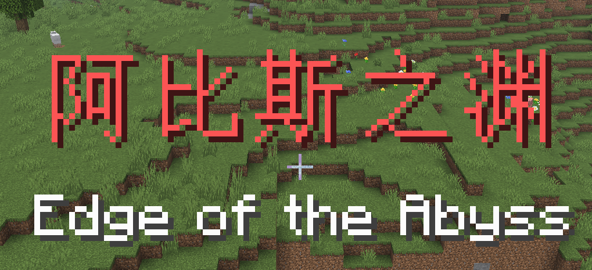

# AbyssCurse



一个为 Minecraft Paper 服务端添加深渊诅咒机制的 PaperMC 插件，灵感来源于《来自深渊》(Made in Abyss)。玩家在深渊中上升时会触发致命的诅咒效果，带来紧张刺激的生存体验。

## 目录

- [功能概述](#功能概述)
- [核心机制](#核心机制)
  - [诅咒系统](#诅咒系统)
  - [生骸系统](#生骸系统)
  - [成就系统](#成就系统)
- [安装与配置](#安装与配置)
- [使用指南](#使用指南)
- [命令参考](#命令参考)
- [权限](#权限)
- [故障排除](#故障排除)
- [贡献与许可证](#贡献与许可证)

## 功能概述

- **插件模式**：支持关闭模式、区域模式、全服模式
- **诅咒系统**：算法上还原原作诅咒机制
- **生骸系统**：玩家在深层诅咒中可能转变为生骸（豁免者）
- **区域管理**：支持自定义深渊区域和豁免区
- **新成就树**：完整的深渊成就树，从赤笛到奈落之底
- **视觉效果**：层级滤镜、视觉特效等沉浸式体验

## 核心机制

### 诅咒系统

#### 目标与豁免

- **目标**：诅咒只以 abyss 区域内的玩家为"目标"
- **豁免区**：允许管理员玩家用两个角点（必须给出完整 xyz 坐标）来定义豁免区，豁免区内的目标不受诅咒影响，即使豁免区位于 abyss 内部
- **豁免者（生骸）**：允许管理员玩家将某个玩家定义为豁免者（称为生骸，narehate）。豁免者在任何情况下都不受诅咒影响

#### 诅咒模式

插件支持两种诅咒模式：

- **abyss-curse 模式**（默认）：诅咒只对作用范围内，二十分钟内累计上升距离超过 2m（y 差值超过 2）的目标起作用。详见下方"累计上升机制"
- **decompression-sickness 模式**：该模式下的诅咒只和玩家所处的高度有关，并且永久持续
  - **浅层**（y >= 0）：施加 abyss-curse 模式中第六层的诅咒内容
  - **深层**（0 > y >= -64）：无诅咒

#### 诅咒层级（abyss-curse 模式）

该模式下受到的诅咒，首先和触发时记录的安全高度有关。当此安全高度位于不同区间时，受到持续十分钟的下列诅咒：

> 以下提到的坐标都是默认值，是我人为将 MC 地下定义为 96 ~ -64 后，按比例从原作的层级尺寸中换算出来的。如果你在做地图，需要把深渊扩展到更大范围，请前往配置文件内自定义（即服务器内的plugins/AbyssCurse/config.yml文件）

##### 零、深渊上空
- **高度范围**：世界高度上限 > y >= 96
- **诅咒**：无
- **效果**：无

##### 一、阿比斯之渊（Edge of the Abyss）
- **高度范围**：96 > y >= 85
- **诅咒**：反胃
- **效果**：进入时显示红色 Title "阿比斯之渊"，subtitle "Edge of the Abyss"，获得成就"赤笛"

##### 二、诱惑之森（Forest of Temptation）
- **高度范围**：85 > y >= 75
- **诅咒**：以上所有 + 饥饿 + 缓慢
- **效果**：进入时显示绿色 Title "诱惑之森"，subtitle "Forest of Temptation"，获得成就"苍笛"

##### 三、大断层（Great Fault）
- **高度范围**：75 > y >= 40
- **诅咒**：以上所有 + 黑暗 + 随机播放音效（音效库包括所有怪物音效、所有洞穴氛围音效、TNT 点燃音效）
- **效果**：进入时显示灰色 Title "大断层"，subtitle "Great Fault"，获得成就"月笛"

##### 四、巨人之杯（Goblets of Giants）
- **高度范围**：40 > y >= 0
- **诅咒**：以上所有 + 霉运 + 挖掘疲劳 + 虚弱
- **效果**：进入时显示天青色 Title "巨人之杯"，subtitle "Goblets of Giants"，获得成就"黑笛"

##### 五、亡骸之海（Sea of Corpses）
- **高度范围**：0 > y >= -8
- **诅咒**：以上所有 + 失明 + 禁止使用右键 + 游戏静音 + 中毒 + 聊天栏不可见
- **效果**：进入时显示蓝色 Title "亡骸之海"，subtitle "Sea of Corpses"，获得成就"白笛"（挑战类进度，音效事件为 `ui.toast.challenge_complete`）

##### 六、来无还之都（Capital of the Unreturned）
- **高度范围**：-8 > y >= -28
- **诅咒**：以上全部 + 寄生 + 凋零，十分钟后诅咒结束未死则化身豁免者（生骸）
- **效果**：
  - 进入时显示金色 Title "来无还之都"，subtitle "Capital of the Unreturned"
  - 只要位于此层级就永久生效：不再允许打开聊天栏（但是可以看见内容）
  - 获得成就"绝界行"（挑战类进度，音效事件为 `ui.toast.challenge_complete`）

##### 七、最终极之涡（Final Maelstrom）
- **高度范围**：-28 > y >= -64
- **诅咒**：以上全部 + 瞬间伤害 2
- **效果**：
  - 进入时显示白色 Title "最终极之涡"，subtitle "Final Maelstrom"
  - 不再允许打开聊天栏（但是可以看见内容）
  - 获得成就"奈落之底"（挑战类进度，音效事件为 `ui.toast.challenge_complete`）

#### 诅咒持续时间

诅咒还和"触发玩家位于的区块"与"中心区块"的切比雪夫距离（此值称为诅咒臂，arm of curse）有关，负面效果时长将随着此值的增大而减小，具体来说是：**10分钟 × (abyss半径 - 诅咒臂) / abyss半径**

任何层级的诅咒触发时，都向目标玩家播放"远古守卫者施加挖掘疲劳时"的音效。

#### 累计上升机制（abyss-curse 模式）

诅咒只对作用范围内，二十分钟内累计上升距离超过 2m（y 差值超过 2）的目标起作用。

> 请注意这个值仅仅是默认值，是为了配合MC过于浅的地下空间的。实际游玩时两格的限制很不合理。如需改变此值请前往配置文件自定义。

##### 安全高度

玩家进入游戏时的 y 坐标被存储为安全高度记录。每次下降、或"累计上升高度清零"时将刷新安全高度（将当前高度设为新的安全高度）。

##### 累计上升记录

插件每秒（20 tick）检查一次每个目标的当前 y 坐标：

- **上升时**：每格上升都会被实时记录（累计上升高度 +1），并在 20 分钟后自动过期（-1），为零时将当时的目标 y 坐标设为新的安全高度
- **下降时**：不积累而是消除"累计上升高度"，并且也刷新安全高度

##### 诅咒触发

若玩家累计上升高度达到 2，将被施加一次"诅咒内容"，然后清零累计上升高度、刷新安全高度以待重新记录。

##### 累计上升高度提示

每一格"累计上升高度"会让玩家的画面显示红色提示文字：
- 0 时不显示
- 1 显示"累计上升高度1"
- 2 显示"累计上升高度2"

### 生骸系统

#### 转换机制

在 abyss-curse 模式下，玩家在第六层"来无还之都"受到诅咒时，可能化身豁免者（生骸）。

#### 祝福

生骸（豁免者）具有一系列被称为祝福的永久性效果：

- **诅咒豁免**：生骸不再受任何诅咒影响
- **成就奖励**：成为生骸就立刻达成成就"来自深渊"（挑战类进度，音效事件为 `ui.toast.challenge_complete`）
- **身份类型**：变成生骸时，玩家从下列身份中随机获得一个：

  **幸运生骸（LUCKY）**，永久获得以下正面效果：
  - 迅捷 2
  - 急迫 2
  - 力量 2
  - 跳跃提升 2
  - 夜视
  - 生命恢复 2
  - 村庄英雄
  - 海豚的恩惠
  - 潮涌能量
  - 幸运

  **悲惨生骸（SAD）**，永久获得以下正面效果：
  - 生命恢复 2
  - 抗性提升 4
  - 伤害吸收 4
  - 抗火
  - 水下呼吸
  - 缓降
  - 聊天栏永久不可打开（即不可输入和发送），但是可以看见聊天栏信息

### 成就系统

本插件添加的成就树称为"深渊"，和原版分离开、互相独立。

#### 成就树结构

```
阿比斯之渊（根节点，默认达成；描述：故事从这里开始）
└── 赤笛（描述：望向深渊）
    └── 苍笛（描述：离开摇篮）
        └── 月笛（描述：刻写历史）
            └── 黑笛（描述：带回故事）
                └── 白笛（描述：成为传说，挑战类）
                    └── 绝界行（描述：有去无回，挑战类）
                        ├── 来自深渊（描述：回归深渊，挑战类）
                        └── 奈落之底（描述：故事不会从这里结束，挑战类）
```

#### 成就获得方式

成就通过游戏内进度系统自动触发，无需手动授予。各成就的获得方式：

- **阿比斯之渊**：根节点，默认解锁
- **赤笛**：进入第一层"阿比斯之渊"时获得
- **苍笛**：进入第二层"诱惑之森"时获得
- **月笛**：进入第三层"大断层"时获得
- **黑笛**：进入第四层"巨人之杯"时获得
- **白笛**：进入第五层"亡骸之海"时获得（挑战类进度）
- **绝界行**：进入第六层"来无还之都"时获得（挑战类进度）
- **来自深渊**：转变为生骸时获得（挑战类进度）
- **奈落之底**：进入第七层"最终极之涡"时获得（挑战类进度）

## 安装与配置

### 环境要求

- **服务器**：PaperMC 1.21 或更高版本
- **Java**：Java 17 或更高版本
- **权限**：服务器管理员权限（用于配置）

### 安装步骤

1. 下载最新版本的 `AbyssCurse-1.1.0.jar`
2. 将文件放入服务器的 `plugins` 目录
3. 重启服务器
4. 编辑 `plugins/AbyssCurse/config.yml` 进行配置
5. 使用 `/abysscurse mode` 命令设置插件模式

### 配置文件

主要配置文件位于 `plugins/AbyssCurse/config.yml`，包含以下设置：

- **插件运行模式**（OFF/ABYSS/WORLD）
- **深渊区域中心坐标和半径**（ABYSS 模式）
  - 中心坐标：中心区块内的任意方块坐标（x, y, z）
  - 半径：切比雪夫距离，单位是区块
- **诅咒模式**（abyss-curse/decompression-sickness）
- **上升积累阈值**（默认 2.0 格）
- **层级范围配置**（可自定义每层的高度范围）
  - 格式：`min <= y < max`
  - 默认范围见上方"诅咒层级"部分
- **调试模式开关**
- **豁免区列表**（两个角点的完整 xyz 坐标）
- **豁免者列表**（生骸玩家 UUID 列表）

### 数据结构

- 玩家数据存储在 `plugins/AbyssCurse/players/` 目录
- 每个玩家一个 YAML 文件（UUID.yml）
- 数据包括：安全高度、累计上升高度、诅咒状态、生骸状态等
- 数据每 5 分钟自动保存一次

## 使用指南

### 插件模式

插件支持三种运行模式：

- **OFF（关闭模式）**：这是默认插件模式。在关闭模式下插件不对任何玩家或生物施加诅咒

- **ABYSS（区域模式）**：允许管理员在主世界定义一个被称为 abyss 的区域。abyss 的位置指的是其中心区块，管理员只需提供中心区块内的任意一个方块坐标即可，插件会自动判断这是哪一个区块。abyss 区域包含其范围内的全部高度，即从世界高度下限 -64 到世界高度上限 320。abyss 的大小指的是一个"半径"值，该值是一个切比雪夫距离，单位是区块，与中心区块距离小于等于这个切比雪夫距离的所有区块都将被纳入 abyss

  > **为什么使用切比雪夫距离？** 原作里阿比斯深渊当然是圆形，按理说应该使用欧几里得距离，但是此插件需要各种频繁的监听，欧式将产生性能问题。此外在 Minecraft 中的深渊是方形很符合直觉

- **WORLD（全服模式）**：整个主世界都被视为是 abyss

## 命令参考

所有命令都需要 `abysscurse.admin` 权限（默认 OP 拥有）。

### 主命令

```
/abysscurse
/abysscurse help
```

或使用别名：
```
/ac
/abyss
```

显示命令帮助信息。

---

### 模式切换

```
/abysscurse mode <off|abyss|world> [centerX] [centerY] [centerZ] [radius]
```

切换插件运行模式。

**参数说明：**
- `off`：关闭插件
- `abyss`：区域模式，需要指定区域参数
- `world`：全服模式

**区域模式参数：**
- `centerX`：深渊中心 X 坐标（任意方块坐标）
- `centerY`：深渊中心 Y 坐标（任意方块坐标）
- `centerZ`：深渊中心 Z 坐标（任意方块坐标）
- `radius`：深渊半径（区块数，使用切比雪夫距离）

**示例：**
```
/abysscurse mode off
/abysscurse mode world
/abysscurse mode abyss 0 64 0 10
```

---

### 重载配置

```
/abysscurse reload
```

重载插件配置文件，应用新的配置设置。

---

### 查看信息

```
/abysscurse info
```

查看插件当前状态信息，包括：
- 当前运行模式
- 深渊区域配置（如果使用区域模式）
- 插件版本

---

### 调试命令

```
/abysscurse debug <on|off|toggle|info|global> [on|off]
```

控制调试模式，用于排查问题。

**子命令说明：**
- `on`：开启玩家调试模式（仅玩家可用）
- `off`：关闭玩家调试模式（仅玩家可用）
- `toggle`：切换玩家调试模式（仅玩家可用）
- `info`：显示玩家调试信息（仅玩家可用）
- `global <on|off>`：控制全局调试模式（管理员可用）

**示例：**
```
/abysscurse debug on
/abysscurse debug toggle
/abysscurse debug global on
```

---

### 生骸管理

```
/abysscurse narehate <set|remove|check> <player>
```

管理玩家的生骸状态。

**子命令说明：**
- `set <player>`：将指定玩家设置为生骸
  - 随机分配生骸类型（LUCKY 或 SAD）
  - 播放不死图腾特效
  - 自动添加到豁免者列表
- `remove <player>`：移除指定玩家的生骸状态
  - 清除生骸类型
  - 从豁免者列表移除
- `check <player>`：查看指定玩家的生骸状态
  - 显示是否为生骸
  - 显示生骸类型（如果存在）

**示例：**
```
/abysscurse narehate set Steve
/abysscurse narehate remove Steve
/abysscurse narehate check Steve
```

**注意：**
- 支持在线和离线玩家
- 设置生骸时会自动播放不死图腾粒子效果和音效
- 生骸自动获得诅咒豁免

---

## 权限

### 权限节点

- `abysscurse.admin`：管理员权限
  - 允许使用所有管理员命令
  - 默认：OP
- `abysscurse.*`：所有权限
  - 包含所有子权限
  - 默认：OP

### 权限配置示例

在权限插件（如 LuckPerms）中配置：

```
/lp group admin permission set abysscurse.admin true
```

## 故障排除

### 常见问题

**Q: 诅咒没有触发？**
- 检查插件模式是否为 `off`
- 确认玩家在深渊区域内
- 检查玩家是否在豁免区或为豁免者
- 使用 `/abysscurse debug info` 查看调试信息

**Q: 生骸转换不生效？**
- 确认玩家具有凋零效果（第六层或第七层诅咒）
- 确认玩家在深渊范围内
- 检查玩家是否已经是生骸

**Q: 配置不生效？**
- 使用 `/abysscurse reload` 重载配置
- 检查配置文件格式是否正确
- 查看服务器日志中的错误信息

## 贡献与许可证

欢迎提交 Issue 和 Pull Request！

查看项目根目录的 LICENSE 文件了解许可证详情。
